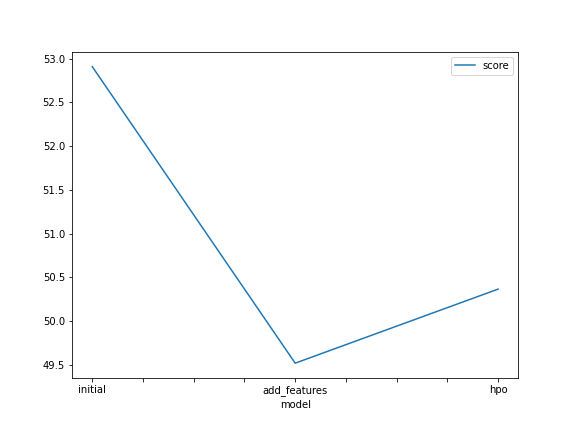
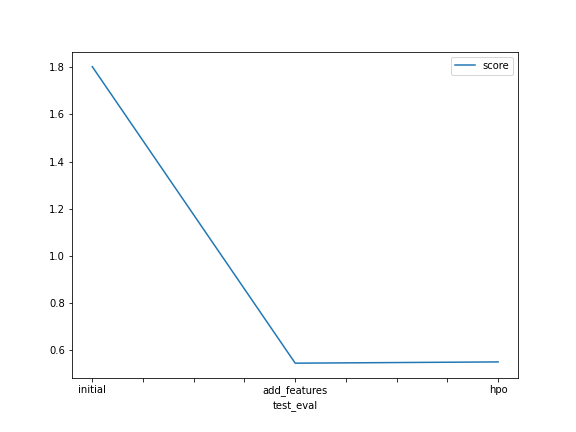

# Report: Predict Bike Sharing Demand with AutoGluon Solution
#### Mostafa Rizk

## Initial Training
### What did you realize when you tried to submit your predictions? What changes were needed to the output of the predictor to submit your results?
Kaggle rejects any submissions where the prediction has a negative value. Since the goal is to ultimately predict bike demand, it makes no sense for a negative number of bikes to be rented. However, a statistical model does not "understand" this so some predictions can be negative. In my case, the minimum predicted count was 2.91, but had there been any negative values I would have set them to 0.

### What was the top ranked model that performed?
WeightedEnsemble_L3. This makes sense because the weighted ensemble algorithm implemented by AutoGluon takes the [average](https://www.cs.cornell.edu/~alexn/papers/shotgun.icml04.revised.rev2.pdf) of several different models, each with different strengths and weaknesses. In a circumstance when one model fails, another might succeed, this can result in performance that is, overall, superior to any individual model, which appears to be what happens here.

## Exploratory data analysis and feature creation
### What did the exploratory analysis find and how did you add additional features?
Season, holiday, working day and weather are all numerical features when they would make more sense as categorical features so that models don't infer an ordinal relationship. According to the AutoGluon documentation, categorical features are ["mapped to monotonically increasing integers"](https://auto.gluon.ai/dev/tutorials/tabular_prediction/tabular-feature-engineering.html). It is unclear if these integers are then one-hot-encoded, which is necessary to avoid the aforementioned problem, so I performed this step manually.

Additionally, the date is represented as a datetime, which is interpreted by models as an integer, but more value might be derived if the models interpreted month, day and hour separately. All other features that we use for prediction follow (roughly) a normal distribution.

### How much better did your model preform after adding additional features and why do you think that is?
The model's score went from 1.80330 to 0.54285, which is approximately 3 times better. 

Exploratory analysis after replacing the datetime feature with month, hour and day showed that rental is cyclical. For example, rentals spike before 10am, before 5pm and after 8pm. These are commute times (before and after work) and during the evening when people are likely returning home from their after-work social activities. These cycles can be modelled statistically and so creating new features to represent them adds predictive power to our models. 

Additionally, four of the eight features we were using were not appropriately represented. Treating categorical data as integers implies an ordinal relationship where the model treats summer, for example, as being greater than spring because the integer representing its category is larger than the integer representing spring's category. This means half of the features in the data were not being leveraged to their greatest predictive potential.

## Hyper parameter tuning
### How much better did your model perform after trying different hyper parameters?
The model performance did not change a great deal after changing some hyperparameters. In fact, it slightly declined. It is possible that a subset of the hyperparameters were actually helpful but were negated by the other hyperparameter, but it is difficult to tell without modifying each hyperparameter in isolation while holding the others constant.

### If you were given more time with this dataset, where do you think you would spend more time?
In this assignment, I changed 3 hyperparameters at once in the tuning phase. Practically speaking, though, these hyperparameters may interfere with one another. If I had more time, I would identify candidate values for each hyperparameter of interest and try all the configurations in a multi-dimensional grid-search. For a real-world project, I would only do this if the estimated time cost was worth the potential improvement in score.

Alternatively, some of the models outperformed the others. It might be worthwhile to investigate these models in isolation and tune their hyperparameters rather than the global AutoGluon hyperparameters.

I don't think there is any way to further pre-process the data so adding features is unlikely to help, in my opinion. However, if we learned new information about each data point, it could allow more accurate predictions. For example, if sporting events are common occurrences and they often cause delays in public transport, that might encourage more people to cycle. We could look at the calendar for the city and add this information as a new feature since we already know the date associated with each datapoint. 

### Create a table with the models you ran, the hyperparameters modified, and the kaggle score.
|model|Time Limit|Num Stack Levels|Num Bag Folds|Score|
|--|--|--|--|--|
|initial|600|1|8|1.80330|
|add_features|600|1|8|0.54285|
|hpo|1800|2|5|0.54817|

### Create a line plot showing the top model score for the three (or more) training runs during the project.

### Create a line plot showing the top kaggle score for the three (or more) prediction submissions during the project.

## Summary
Overall, in this project I used AutoML (via the AutoGluon library) to train a variety of models to predict demand for bikes in a bike-share business. The main learning outcome for me was seeing what a tremendous difference data pre-processing can make. In the case of this project, some very simple pre-processing like replacing a datetime feature with day, month and hour features, as well as choosing correct data types for other features, lead to a 3x improvement in score. Hyperparameter optimisation proved to be more challenging. Tuning hyperparameters requires a systematic approach, featuring methods such as grid search, and a thorough understanding of the different models. This was outside the scope of this particular project but is something I hope to experiment with in future projects. 
